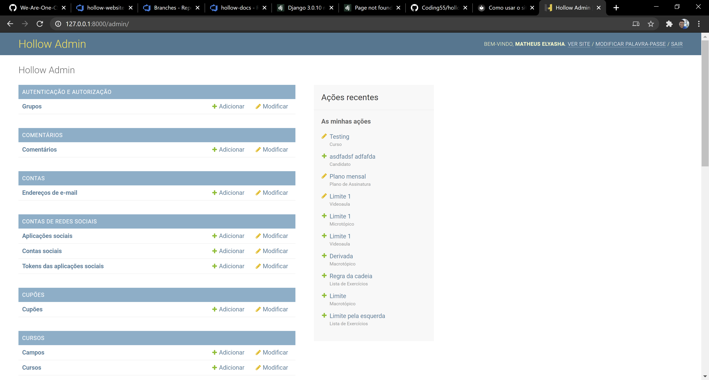

# Como utilizar o site do administrador (admin)

Para utilizar o site, basta ir a ``/{ADMIN_URL}``, que pode ser um valor diferente para segurança do website.

# Vai ter uma interface gráfica

Na interface, existe a possibilidade de alterar os dados na base de dados de uma forma muito mais simples.

Convidamo-lo a jogar com a página, é realmente simples e esperamos que goste de modificar as suas páginas.

